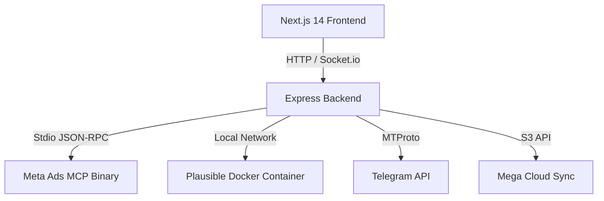

# Development Guide: Admin Panel & Ads OS

This guide details the local setup, architectural design, model context protocol (MCP) implementation, and integration parameters for the Admin Panel.

---

## Technical Stack & Architecture



### Port Configuration
- **Frontend App**: Next.js running on Port `3000`
- **Backend API**: Node/Express running on Port `3001`
- **Plausible Analytics**: Configured to bind on Port `8000` (Docker)

---

## Local Development Commands

### 1. Backend Service
From `/backend`:
```bash
# Install dependencies
npm install

# Run development server with hot-reload
npm run dev
```

### 2. Frontend Service
From `/frontend`:
```bash
# Install dependencies
npm install

# Run next.js development server
npm run dev
```

---

## Environment Variables (`.env`)

Save the following configuration inside `/backend/.env` (and duplicate to root `.env` for Docker):

```env
# Server Config
PORT=3001
NODE_ENV=development
JWT_SECRET=your-jwt-secret-key

# Meta Ads Marketing API (MCP)
META_ADS_ACCESS_TOKEN=EAA...
META_AD_ACCOUNT_ID=act_...
META_APP_SECRET=...
META_BUSINESS_ID=...

# Plausible Analytics Integration
PLAUSIBLE_DASHBOARD_URL=http://localhost:8000/share/yoursite.com?auth=...
```

---

## Meta Ads MCP Integration Details

The backend utilizes `meta-ads-mcp-server.exe` located at `backend/bin/meta-ads-mcp-server.exe`.

### Execution Flow
1. The backend routes client requests via `POST /api/fb-mcp/call` (carrying `{ tool, args }`).
2. Express spawns the binary using a child process (`spawn`), passing configuration variables in `process.env`.
3. The backend sends two JSON-RPC frames over `stdin`:
   - An **Initialize** frame (`initialize` method).
   - A **Tool Call** frame (`tools/call` method with tool name and arguments).
4. The backend buffers `stdout` until the process exits, parses the JSON response, and returns the result matching RPC `id: 1` back to the Next.js client.

### Essential Meta API Tools Mapping
- **Campaigns**: `get_campaigns`, `create_campaign`, `update_campaign`
- **Ad Sets**: `get_ad_sets`, `get_reach_estimate`, `search_interests`
- **Creatives**: `get_ad_creatives`, `create_ad_creative`
- **Insights**: `get_insights`, `get_account_insights`

---

## Plausible Analytics Integration Details

Plausible runs inside Docker container instances on the host Linux server. 

### Local Proxy Configuration
Rather than exposing Plausible's management UI to the public web, the panel renders it using Option 1 (Iframe Embed).

1. Generate a secure shared link inside Plausible's site settings (`Settings → Visibility → Shared links`).
2. Input the URL containing the authorization hash parameter (`auth=...`) into the **Web Analytics** setup input.
3. Next.js reads the parameter via GET `/api/fb-mcp/config` and renders the dashboard in a sandboxed iframe.
